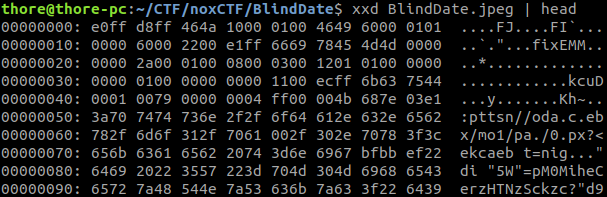
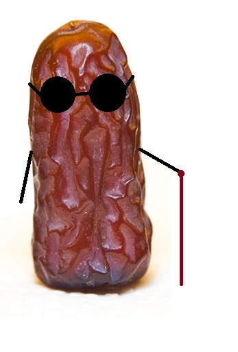
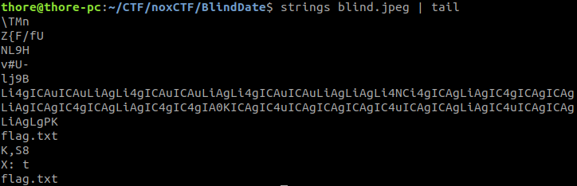

## Blind Date

> My mom got me a date with someone! she sent me an image but i cannot open it. I don't want it to be a blind date. Can you help me?

By inspecting the data of the file with xxd we notice that the bytes are scrambled.



After taking a look at the JPEG File Interchange Format we can quickly see how the bytes have been scrambled
[Link](https://en.wikipedia.org/wiki/JPEG_File_Interchange_Format#File_format_structure)

The file should start with the bytes `FF D8 FF E0` then comes a 2 byte value which holds the segment length.
Next comes the JFIF Identifier `4A 46 49 46 00`.

We notice that they just took blocks of 4 Bytes and reversed them.

```python
f = open('BlindDate.jpeg', "rb")
s = f.read()
f.close()

data = ''
for i in range(0,len(s),4):
    data += s[i:i+4][::-1]

nf = open('blind.jpeg','wb')
nf.write(data)
```

this script will write the restored image to `blind.jpeg`



strings reveals that there is some data at the end of the image:



a base64 String `Li4gICAuICAuLiAgLi4gICAuICAuLiAgLi4gICAuICAuLiAgLiAgLi4NCi4gICAgLiAgIC4gICAgICAgLiAgICAgIC4gICAgLiAgIC4gIC4gIA0KICAgIC4uICAgICAgICAgIC4uICAgICAgLiAgIC4uICAgICAgLiAgLgPK` and it decodes to:

```
..   .  ..  ..   .  ..  ..   .  ..  .  ..
.    .   .       .      .    .   .  .  
    ..          ..      .   ..      .  .

```

The text is Braille and translates to `F4C3P4LM`

Next we extract a zip archive with binwalk. We can unzip the archive with the password `F4C3P4LM` and receive a file called flag.txt.
This file contains brainfuck code and running it prints the final flag.

```
++++++++++[>+>+++>+++++++>++++++++++<<<<-]>>>>++++++++++.+.+++++++++.<---.+++++++++++++++++.--------------.>+++.<+++++++++++++++++.<++++++++++++++++++.>>------.---------.--------.-----.++++++++++++++++++++++++++.<<.>>----.<++++++++.+++.>---------.<<+.>>++.<++.-----.+++++.<+++.>>++++++.<<-.>-----.<+.>.+++.>--------.<<---.>>++.<++.-----.+++++.<+++.>>++++++.<<-.++++++++++++.>>+++++++++.<<<++++++++++++++++++++++.```
```

the flag is: `noxCTF{W0uld_y0u_bl1nd_d4t3_4_bl1nd_d4t3?}`
