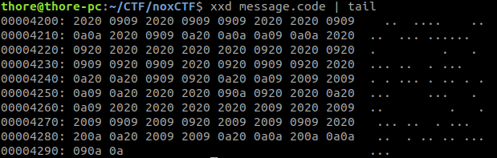
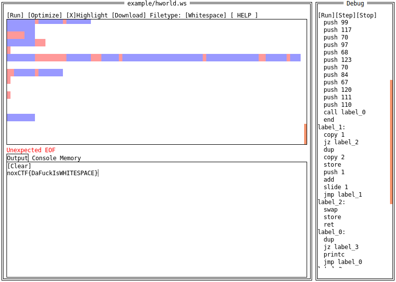

# Read Between The Lines

The file is a gzip compressed archive.

```
$ file message.code 
message.code: gzip compressed data, was "message", last modified: Fri Jul 20 12:53:57 2018, from Unix
$ mv message.code message.code.gz
$ gzip -d message.code.gz
```

The jsfuck inside the file is just giving us a `nope` but there are some characters after that which seem interesting.
Remove all the jsfuck stuff and only keep the rest.



The bytes are spaces `0x20`, tabs `0x09` and newlines `0x0a`.

There is an esoteric programming language called whitespace

[Here](https://vii5ard.github.io/whitespace/) is a cool website with an interpreter.



The flag is: `noxCTF{DaFuckIsWHITESPACE}`
